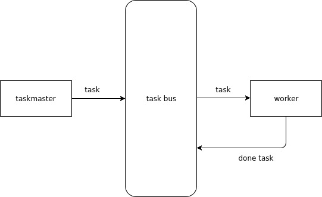
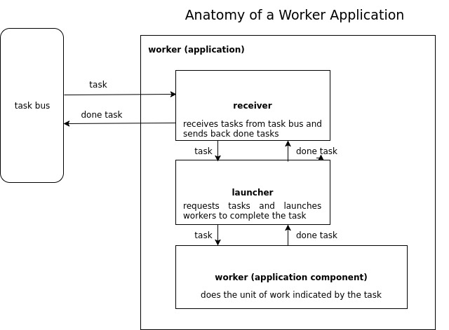

# task

A super sweet, simple, flexible and powerful task management system 
written in Go.

## Why 'task' is Better

There are many task-like frameworks and gui systems but we think 'task'
is better.

- Loosely coupled components
- Encourages a micro-service architecture
- Clean separation between components that make tasks (taskmasters) and
components that do tasks (workers)
- Stateless
- Not GUI based
- Simple to understand and implement
- Open source with MIT licensing
- Implemented in Golang
- Easy to scale

## Overview

### Players

- Worker (do the work)
- Taskmaster (create tasks)
- Task Bus (message bus for communicating tasks)


### Basic Flow

A taskmaster creates a task and sends it to the task bus. A worker listens
on a task bus for tasks it knows how to do. The worker does the task and
returns the results back to the task bus.



### Quick Start: Make Your First Worker

Because of the de-coupled nature of Task you can create workers in any
language. The Task framework is written in Golang and provides components
that will take care of the boring and tricky parts of worker creation 
like launching workers and interacting with the task bus. Therefore, by
writing your workers in Golang you will be able to take advantage of 
those components. Plus, Go is fun ;), well suited for writing server-side 
applications and pretty easy to learn.

This tutorial assumes you know the basics of Golang and have a working
local golang environment with the latest version of Go.

Let's get started.

*Hello World! worker*

This worker, when launched, will print 'Hello, world!' and the time, 
to stderr.

1. Download the 'task' library:

```bash
$ go get github.com/pcelvng/task/...
``` 

In your Go path create a directory called "hello-world". In that 
directory create a file called "worker.go" and paste in it the following 
code:

```golang
package main

import (
	"log"
	"os"
	"os/signal"
	"syscall"
	"time"

	"github.com/pcelvng/task"
	"github.com/pcelvng/task/launcher"
	"github.com/pcelvng/task/receivers/flex"
	"github.com/pcelvng/task/util"
)

func main() {

	// make a basic 'stdio' receiver (for reading and responding to the task bus)
	rcvrConfig := util.NewBusesConfig("stdio")
	rcvr, err := flex.NewFlexReceiver(rcvrConfig, "", "", "")
	if err != nil {
		log.Println(err.Error())
		os.Exit(1)
	}

	// make the launcher
	lnchr, err := launcher.New(rcvr, launchFunc, nil)

	// signal handling, start and wait
	closeChan := make(chan os.Signal)
	signal.Notify(closeChan, syscall.SIGINT, syscall.SIGQUIT, syscall.SIGTERM)

	// start the launcher
	closedChan, err := lnchr.Start()
	if err != nil {
		log.Println(err.Error())
		os.Exit(1)
	}

	// start the task processing loop
	lnchr.Do()

	select {
	case <-closeChan:
		log.Println("shutting down...")
		lnchr.Close()
	case <-closedChan: // lnchr.Close called internally by the Launcher
		break
	}
	log.Println("done")
}

func launchFunc(tsk *task.Task) task.Worker {
	return &HelloWorldWorker{
		tsk:      tsk,
		taskChan: make(chan *task.Task),
	}
}

type HelloWorldWorker struct {
	tsk      *task.Task
	taskChan chan *task.Task
}

func (w *HelloWorldWorker) DoTask() chan *task.Task {
	go w.doTask()
	return w.taskChan
}

func (w *HelloWorldWorker) doTask() {
	w.tsk.Start()
	log.Printf("Hello, world! The time is '%v'", time.Now().String())
	w.tsk.Complete("I did it!")

	// Send the completed task back to the task bus.
	w.taskChan <- w.tsk
}

func (w *HelloWorldWorker) Close() error {
	return nil
}
```

Open a terminal, switch to the 'hello-world' directory and build 
and run the worker as follows:

```bash
$ cd /path/to/hello-world
$ go build
$ echo '{"type":"hello-world","task":""}' | ./hello-world > done.task.json
```

You should see output like this:

```bash
2017/10/28 15:40:12 created stdin consumer
2017/10/28 15:40:12 created stdout producer
2017/10/28 15:40:12 Hello, world! The time is '2017-10-28 15:40:12.315024862 -0600 MDT m=+0.005050868'
2017/10/28 15:40:12 done
```

If that is what you see then you just built your first worker. Easy-peezy.

Notice that a task is just a simple JSON object. 

```json
{"type":"hello-world","task":""}
```

Usually a task object will also have the 'task' and 'created' fields populated. 
Like this:

```json
{"type":"hello-world","task":"2017-03-01T12", "created":"2017-10-28T15:33:28.572872012-06:00"}
```


This example was simple enough that we didn't the 'task' and 'created' fields 
populated. The 'task' field is important to tell the worker *what* to do. 
In this case the worker already knows what to do. The 'created' field 
tells *when* a task was created. It's good for record keeping but not 
required for task processing. When you use the task framework to create 
a task the 'created' field will be populated automatically.

Notice that in this case we didn't use a taskmaster to create the task 
but instead just used the 'echo' command to push a task object to our 
'hello-world' worker through the 'hello-world' worker stdin.

The task bus in this simple worker is just 'stdio'; tasks are received 
from stdin and pushed back out to stdout when completed.

You can view the completed JSON task object looking at the 'done.task.json'
output file you created when you processed your first task.

```bash
$ cat done.task.json

{"type":"hello-world","task":"","result":"complete","msg":"I did it!","started":"2017-10-28T15:42:07.861151511-06:00","completed":"2017-10-28T15:42:07.861193165-06:00"}
```

Notice that the finished task object has the same fields as the unfinished
task object and now includes a few more fields:

- 'result' - can be either 'complete' or 'error' (if task processing didn't go so well)
- 'msg' - result message to provide a better report on how the task processing went. 
  It could contain statistics like how many messages were processed or a more 
  detailed error message like 'failed because of a network problem'.
- 'started' - indicates when a task was started.
- 'completed' - indicates when a task was done being processed.

Task objects are intended to be simple and flexible. A worker just needs
the 'type' and 'task' fields to know what to do.

The 'task' field was empty in this simple example but can contain any
kind of information in any format you choose in order to communicate to 
a worker the parameters it needs to complete the task. For example, a 'task' 
field value of "2017-01-01T10" can communicate to a worker to load some 
records from a configured location, process those records and then publish
the records to another worker-configured location like a database.

Many kinds worker will need a time component in order to know exactly 
what to do. 

If you want to see an example of a more complicated worker look in the 
'apps/workers/noop/' directory. The 'noop' or 'no-operation' worker 
simulates a worker that will simulate task processing but does not 
actually do anything. This is useful for simulating the mechanics of a 
full task ecosystem. It's also a good example of a worker that does a 
bit more than 'hello, world'.


## Tasks

A task is just a simple JSON object like this one:

```json
{
   "type":"task-type",
   "task":"2017-01-01T01",
   "created":"2017-10-28T15:42:07.8"
}
```

It represents a small unit of work that a worker will know how to 
complete.

A worker receives a task like the one above, works on the task and then
adds information to the original task object about how the processing 
went. The done task is sent back to the task message bus for other 
applications to consume or respond to.

Example of a done task:

```json
{
   "type":"task-type",
   "task":"2017-01-01T01",
   "result":"complete",
   "msg":"completed successfully!",
   "started":"2017-10-28T15:42:07.1",
   "completed":"2017-10-28T15:52:04.8"
}
```

Example of a done task with an error:

```json
{
   "type":"task-type",
   "task":"2017-01-01T01",
   "result":"error",
   "msg":"error processing task!",
   "started":"2017-10-28T15:42:07.1",
   "completed":"2017-10-28T15:52:04.8"
}
```

A task is created by a taskmaster; an application that specializes in
creating tasks. A task is completed by a worker; an application that 
carries out the command of the taskmaster to do a task of a particular 
type. The worker will mark the original task with information that 
describes how the processing went - like the outcome (complete, error) 
and the time it completed the task.

As you can see, even a done task object is very simple.

### Worker

A worker is a single application that knows how to do a particular
kind of task. A kind of task is called a 'task type'. A task type is just
a simple string identifier. A worker is constructed knowing how to do a 
task type called 'special-task'. So, when a task of type 'special-task'
is sent to the task bus then the task will immediately start working on
that task.

A worker is created by creating a worker launch function and implementing 
the 'Worker' interface. The worker launch function type and Worker interface
are located in the 'worker.go' file in the main directory.

### Taskmaster

A taskmaster specializes in creating tasks. Tasks are created in response
to some kind of event. A common kind of event is the passage of time. If,
for example, it is 5 minutes after the hour a taskmaster may know to create
a task of a particular type. Another kind of event could be the successful completion 
of a task. When one kind of task is successfully completed a taskmaster
can listen to the task bus and respond by creating a task of a different
type.

There are many kinds of events that a taskmaster can know how to respond 
to. This framework provides a number of basic taskmasters that will handle
task creation to a number of basic events. To see the taskmasters the task
framework provides navigate to the 'apps/taskmasters/' directory. 

The framework taskmaster will likely fit your needs out-of-the box. So, 
for now you will probably want to focus on creating workers. To create a
worker see the section below called 'Make Your Own Worker'. 

### Task Bus

A task bus is just a message bus used for communicating tasks. It it used
to communicate tasks that need to be completed and tasks that are already 
done.

You can implement your own task bus but this framework provides a number 
of different kinds of task buses. You can choose the task bus that fits
your needs the best. 

To see all the task buses the Task framework provides out-of-the box 
navigate to the 'bus/' directory.

You will probably not need to make your own task bus. But, if you want 
to make your own bus anyway just implement the bus interface found at
'bus/bus.go'.

#### Message Bus Primer

A task bus is just a message bus or messaging system that facilitates 
the flow of tasks. There are many kinds of message buses (also called 
message queuing systems) available. Some of the most common include:

- NSQ (http://nsq.io/)
- Kafka (https://kafka.apache.org/)
- NATS (https://nats.io/)
- Google Pub/Sub (https://cloud.google.com/pubsub/docs/overview)

We've also abstract basic local io (reading and writing files) for a 
simple message bus. This is useful during development.

A message bus will host tasks in different message queues called 'topics'. 
When something posts (or produces) a message to the task bus it will 
post (or write) to a topic. Topics have names - the name is whatever you
decide to call the topic. Topics are a way to organize messages of 
different types or messages of the same type that have different purposes.

A message bus facilitates a publish/subscribe message model. An application
can 'publish' or 'produce' a message to a message bus on a topic. 
Alternatively, an application can subscribe or listen to messages on a 
particular topic. When a message is read from the message bus we say
that the message has been 'consumed'. Applications that subscribe to
a topic on a message bus are also called 'consumers'.

Frequently there are several 

## Make Your Own Worker

Generally when we talk about workers we refer to a self contained 
application that, when started, will listen to the task bus for tasks
of a particular type. However, within a worker application are three
components:

- Worker (the part you make)
- Receiver (receives tasks from the task bus and posts responses)
- Launcher (manages the logistics of launching workers)



### Worker Design Goals

#### Idempotency
 
It's important that a worker is able to complete a task without affecting
the outcome of another task, either running at the same time or at a 
different time. When the completion of a task affects the successful 
completion of another task we call that interaction a 'side-effect'. 
Side-effects are almost always a bad thing. They can put your system in
an inconsistent and unpredictable state.

There are many reasons for side-effects, some of those reasons include:

- Not properly cleaning up a task (cleaning up db entries, files)
- Improper carryover of a local cache (the leftover cache from one task
  affects the outcome of a subsequent task)
- More than one task of the exact same type and value (for more about a 
task value see more about tasks in the 'Tasks' section) is running at 
the same time.
- Input data for a task is different when running a task of the same type
and value multiple times.

In general, a worker should be designed such that a task can be run x
number of times, either in parallel or serially and achieve the same 
reliable outcome. 

A worker outcome is considered 'idempotent' when a worker can achieve 
processing a task without affecting the successful outcome of another 
task regardless of whether the task was processed in the past, present
or future.

Idempotency is the 'gold standard' of worker design. In practice, in 
may not be possible to achieve idempotency. In these cases, it's critical
to design your workers to do whatever possible to prevent, detect and 
recover from side-effects.

If you know that there are potential side effects it is a good practice
to document what they are and then create other processes to detect and
heal from the side effect.

You may, for example, write another worker (worker B) that is scheduled 
to run a task (task B) after the completion of a task (task A completed 
by worker A) to check for and report on side-effects and create a way 
to heal the side-effects in order to get the system back in a good state.

#### Small Units of Work

Unless you are running a system like Hadoop that specializes in massive 
parallel processing one task over a cluster of servers, parallelism is
very difficult to program and can have many potential problems and 
side-effects. 

If you have a task that requires massive parallel processing you can 
create a worker that will launch a system like hadoop that will do the 
heavy lifting to complete the task and then that worker can report on
the successful completion of the task.

Alternatively, we strongly suggest you design your workers to process
'small' units of work. In general, the smaller the better. Smaller means
that you can simply launch more tasks and then distribute the work at 
the task level over one or more worker applications running at the same
time.

#### One Worker Application Instance Does One Task at a Time

It may be tempting to create one worker application that can handle
many tasks at the same time to achieve task parallelism. While the 
launcher is designed to handle launching more than one worker within an
application we generally do not recommend configuring production 
environments to work this way. Instead we recommend parallelization by 
having many instances of the same worker running across many servers.  

There are several reasons for this:

1. If the worker application fails then all in-progress tasks will not
complete successfully and will have to be re-created by a task master and
tried again. By having a worker application handle more than one task at
a time you increase the failure domain of a single application. In other
words, when a worker fails it fails harder.
2. Working on many tasks in the same worker application at the same time
creates more possibility of side-effects. For example, the worker may
implement a shared cache. It may be that sharing that cache locally 
among more than worker affects a consistent outcome and will, therefore, 
create side-effects.
3. It trains us to think about tasks in a distributed micro-services 
eco-system instead of a monolithic single instance. In general, 
micro-services can be designed with more resilience, fault-tolerance, 
and scalability. Think about wrapping your workers in docker containers 
and then scaling the number of instances automatically according to the 
work load.

#### Task Order Agnostic

Units of work should be designed such that tasks can be processed in any 
order. For example, if three tasks, "A", "B" and "C" are received by a 
worker and processed one-at-a-time the final outcome of each should be 
the same regardless of processing order. It should be able to process 
the tasks in any order: 

- "A", "B", "C"
- "C", "B", "A"
- "B", "A", "C" 

The final results of each should be the same regardless.

#### Worker Attempts to Detect Side Effects

If there is more than one instance of a worker of a particular type then 
it is very possible that that at some point the same task will be processed 
more than once at the same time. This could occur because:

**A message is delivered twice** 

Most message buses have an 'at least once' or 'at most once' message 
delivery guarantee not an 'exactly once' deliver guarantee. Therefore, 
it's possible that two instances of a worker could receive the same task 
at almost the same time and therefore process the task with some overlap. 
This kind of processing overlap could cause side-effects.

**The same task is created twice at almost the same time**

Since taskmasters are independent applications that have little to no 
knowledge of each other it's possible that the same task could be created 
independently by two different taskmasters. For example:

- A cron (time based) task is created and the same task is created as 
a one-off request by a user.
- A task is created as part of a batch of tasks and at the same time a 
same task is created automatically because a process detected some missing 
results and tried to automatically 'heal' by creating the task.
- A task is created again as an automatic retry effort because it 
originally failed. About the same time another taskmaster detects bad 
results (because of the failed task) and automatically creates a task to 
attempt to repair the results.
